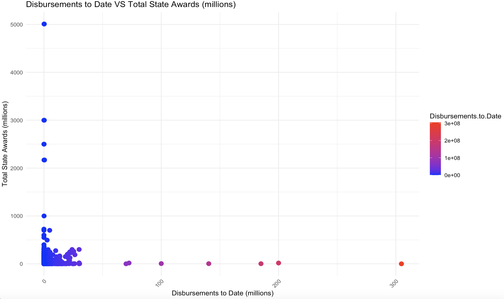
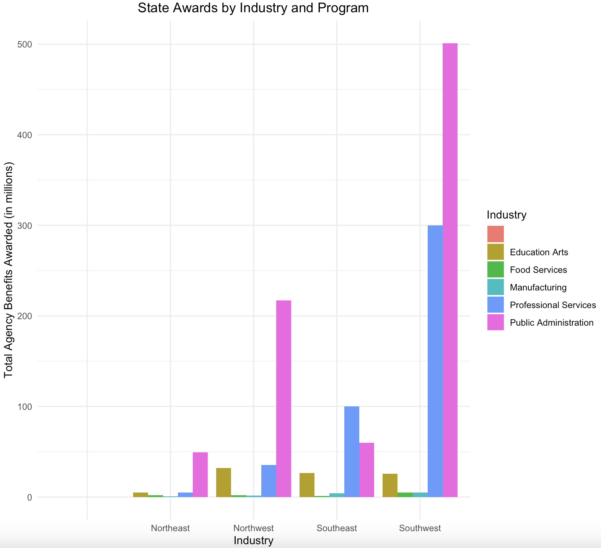

# Data-Noobs

# **Team Members**

- Elina Paraschou, MS Analytics at American University
- Kritika Goyal, MS Analytics at American University
- Nabila Nishat Raisa,  MS Analytics at American University
- Aatsend Lkhagvadorj, MS Analytics at American University

# **Topic**

Allocation of public invenstments within New York State with a focus on minority/women programs and small businesses.

# **Abstract**

In today's competitive market, equal distribution of public funds among industries, programs, and regions is vital to make well-informed decisions that promote economic growth and optimizes resource allocation. This analysis examines the impact of federal funding within New York state with a focus on small businesses and minority/related programs in the state, using the Database of Economic Incentives from data.gov. A multiple OLS regression analysis was performed to assess how public awards are influenced by regions, programs, industries, and disbursements to date. Hypothesis testing was conducted to diver deeper into the effects of public funding on minority/women related programs and small businesses. Our research shows a concerning trend. In both the case of minority/women programs and small businesses, the allocation of funds falls below the desired threshold. Specifically, for every additional dollar invested in small businesses, there is a decrease of $16,050 in agriculture. Women and people of color make up a significant of portion of the agriculture industry in New York. Additionally, for every dollar allocated in minority/women related programs, there is an increase of $7,154 in agriculture, which indicates the unique challenges women face in the labor market. This analysis shows the disparities in the distribution of public funds and highlights the need for more equitable resource allocation. Achieving a fair balance across these sectors is vital for promoting economic diversity, supporting minority and women programs. Addressing these disparities in funding allocation is important to foster social equity in New York state. 

# **Documentation**

We used Excel to clean the data, recode our variables, and create summary tables with key metrics for our quantitative and qualitative variables. We used R for our statistical analysis and visualizations. 

# **Data Extracting**

We used the “Database of Economic Incentives” from data.gov. It shows resources for businesses and programs seeking public and private funding. We focus on the funds the Department of State receives and allocates in different programs within New York State. We also looked at industry and occupation data from the Department of Labor within New York State.

**Industry & Occupation Data:** https://dol.ny.gov/occupational-and-industry-data

**Lanza, A.J. (2023) NYC Small Business NYSenate.gov:** https://www.nysenate.gov/newsroom/articles/2023/andrew-j-lanza/nyc-small-business 

**Small business first - nyc.gov:** https://www.nyc.gov/assets/smallbizfirst/downloads/pdf/small-business-first-report.pdf

**Dol, N. (2023) 2023 gender wage gap report: Impact of covid on women, NYS DOL Reports**:https://nysdolreports.com/gwg/2023-gwgreport/

**Original Dataset:** https://catalog.data.gov/dataset/database-of-economic-incentives 

**Cleaned Data:** (https://github.com/AGA-Datathon-2023/Data-Noobs/blob/main/NY%20Economic%20Incentives.csv)

**Description of Variables**
- The ‘Program’ variable consists of various programs that received state funding. Due to the vast amount of programs, we categorized them into: Agriculture, Business, Development, Direct Federal Funds, Employment, Environment, Federal Department of Defense, Innovation/Education, Minority/Women related Programs, Misc.,Small Business, and
Tax Programs.
- 'Region' refers to the geographical locations withing New York State. We categirized it to: Northeast, Northwest, Southeast, and Southwest.
- 'Industry' includes multiple sectors that programs operate in. We categorized it to: Education Arts, Food Services, Manufacturing, Professional Services, and Public Administration programs.
- 'Total State Awards' is the total Department of State assistance projects received.
- 'Disbursements to Date' is the amount the projects have received up to date. 

# **Statistical Modeling**
- Multiple Regression Analysis (MLR)
- Power Analysis
- Hypothesis Testing

# **Data Viasualizations**

- Scatterplot

There is weak correlation betweeen them as the data points are not closely grouped.

All of the data points are within Cook's distance lines which indicates that there are no influential points in our model.

In this scale-location plot, the residuals are spread closely near the red line, which is horizontal. Points 807 and 120090 are the outliers. In this plot, the assumption of equal variance (homoscedasticity) is good as the horizontal line has equally (randomly) spread points. 

This Q-Q normal plot shows that the residuals are normally distributed. It’s good as the residuals are lined well on the straight dashed line.

Linearity holds reasonably well, as the red line is close to the dashed line. We can also note the heteroscedasticity: as we move to the right on the x-axis, the spread of the residuals seems to be increasing. Finally, points 807 and 120090 may be outliers, with large residual values.

- Bar Plot

Economic activity is most active in the southwest region which is expected as New York City is more densely populated compared to the rest of the state. Public Administration programs receive the most funidng in the southwest and the rest of the regions.

- Presentation Quality Tables (quantitative & qualitative variables)

# **Results & Interpretations**

In our analysis, we assesed how the allocation of awards from the Department of State in New York is influenced by disbursements to date, programs, regions, and industries. The distribution of the funds is not evenly spread among programs, industries, and regions. We also wanted to dive deeper and focus on the impact public funds have in minority/women programs and in small businesses. 

**Minority/Women:**
Using an alpha of 0.05, the entire model is statistically significant, and the null hypothesis is rejected, keeping all else constant. 
Null rejected, so there is evidence that the average total state awards for minority women related programs is less than the threshold.

In 2021, women in New York earned 88.2 cents for every dollar earned by their male counterparts, a figure notably better than the national average of 81.5 cents. However,the gender pay gap remains significantly wider for women of color, both in New York and across the country. This context highlights the significance of our findings. Specifically, Black or African American women in New York earned only 67.8 cents for every dollar earned by men, while Hispanic and Latino women received just 62.9 cents for each dollar earned by their male counterparts. These disparities underscore the importance of programs supporting minority women-related initiatives.

The economic recession triggered by the pandemic had a profound effect on the female workforce. Between 2019 and 2021, the unemployment rate among women surged, nearly doubling from 4.2% to 8.2%. In 2021, the number of unemployed women exceeded 405,000, which marked a substantial rise compared to 2019 when it stood at 207,000. 

Occupations that are both low-paying and heavily segregated by gender, such as education, are primarily staffed by women, who make up 90% of the workforce in this sector. Women are more likely to take temporary breaks from their careers or work part-time to care for their children. These circumstances can directly impact their income and job opportunities.

Governor Hochul's FY 2023 Budget allocated $7 billion over four years to enhance affordable childcare access,raising the income eligibility threshold to 300% of the federal poverty level. This extends access to over half of New York's young children and broadens the options for childcare providers. In 2023, Governor Hochul launched a pioneering program offering 12 weeks of fully paid parental leave to over 10,000 unrepresented state employees for bonding with a child. The program may also extend to employees through collective bargaining with state unions.

**Small business:**
Using an alpha of 0.05, the entire model is statistically significant, and the null hypothesis is rejected, keeping all else constant. 

Small businesses are the backbone of New York City's economy. Out of the 200,000 businesses in the city, 98% are considered small, with fewer than 100 employees, and 89% are categorized as very small, with fewer than 20 employees. These small enterprises employ over 50% of the city's private sector workforce and frequently offer entrepreneurs their first opportunity for economic self-reliance and a path to the middle class. 

Small businesses have consistently identified government regulations as a significant challenge. City small business owners have repeatedly expressed their frustration with the intricate web of requirements and procedures they must navigate to establish, run, and expand their enterprises. These concerns are well-founded. New York City operates within a complex regulatory framework, encompassing over 6,000 rules and regulations, approximately 250 business-related licenses and permits, and numerous compliance processes designed to uphold legal standards.

To address these challenges,the NYC Business Express Service Team (BEST) initiative has played a pivotal role in preserving over $22 million for small businesses in New York City by helping them evade fines and violations. Since its inception, NYC BEST, a no-cost program, has aided over 2,200 diverse businesses throughout the five boroughs. It provides personalized expert guidance, allowing business owners to effectively address or prevent fines and violations, streamline their interactions with the city government's rules and regulations, and expedite the permit and licensing procedures while also saving time and money.

Small Business Month commences amidst New York City's remarkable economic resurgence. The city has already reclaimed 99.7% of its pre-pandemic private sector jobs, defying previous forecasts that predicted recovery well into 2025 or beyond, as reported by the New York State Department of Labor (NYSDOL). Achieving a full 100% recovery, anticipated within weeks, will establish a historic milestone with the highest number of private sector jobs ever recorded across New York City's five boroughs.

Based on the regression analysis, we interpreted the significance of the Region, Industry, Programs, and Disbursement to date to the allocation of awards from the Department of State in New York. In accordance with that, the Disbursement to Date with the coefficient of 2.319e-02 indicating that a one-unit increase is associated with an estimated increase of 0.02319 units in the allocation of awards and it is statistically significant with the p-value of 0.018945. For Northwest region, the coefficient is 7.453e+05, suggesting that being in the Northwest region is associated with an estimated increase of 7.453e+05 units compared to the reference region. This coefficient is statistically significant the p-value of 0.006049. Whereas Southeast and Southwest, it is similar to the previous region, these coefficients indicate that residing in the Southeast and Southwest regions is associated with estimated increases in the allocation of awards. Both coefficients are statistically significant. In Industry, each of these represents a different industry category. The coefficients indicate how being in a specific industry is associated with changes in the allocation of awards compared to a reference category (the omitted category). For example, "Food Services" has a negative coefficient, suggesting it's associated with a decrease in the allocation of awards. These coefficients have varying levels of statistical significance. In the program variables, the program types are represented differently. For example, "Development" is associated with an estimated increase of 2.997e+06 units in the allocation of awards compared to the reference category.Some program types, such as "Innovation/Education" and "Misc.," have highly significant coefficients, while others are not statistically significant in the model. 

# **Limitations**

Limitation include the outliers that need to be removed. The findings are not substantively significant. Disbursements to date and public investments are correlated but may not necessarily have a meaningful connection.

# **Conclusion**

This analysis confirms that public awards are not evenly spread among industries. We recommend further analysis into the allocation strategies in New York to promote economic diversity. Specifically, adding a variable to measure the job creation impact of funded programs by race and sex. This can help the Department of State in New York to prioritize sectors, that they may not be currently well represented, with the most job-creating potential and long-term boost of the economy. 

