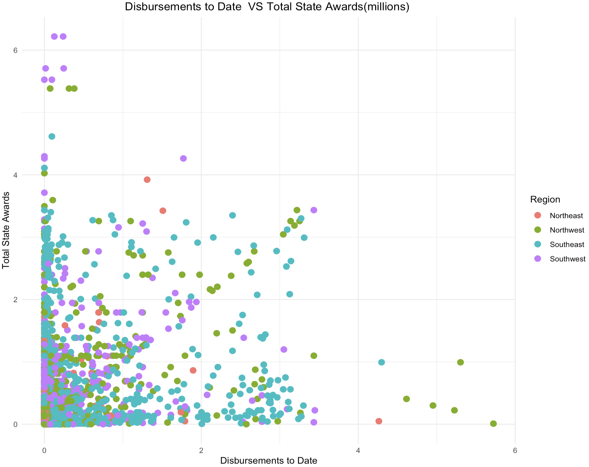

# Data-Noobs

# **Team Members**
- Aatsend Lkhagvadorj
- Elina Paraschou
- Kritika Goyal
- Nabila Nishat Raisa

# **Topic**

# **Abstract**

# **Documentation**
We used Excel to clen the data,select our variables, and create presentation quality tables for our quantitative and qualitative variables. We used R for our statistical analysis and visualizations. 

# **Data Extracting**
We used the “Database of Economic Incentives” from data.gov. It shows resources for businesses and programs seeking public and private funding. We focus on the funds the Department of State receives and allocates in different programs within New York State. We also looked at industry and occupation data from the Department of Labor within New York State.

**Industry & Occupation Data:** https://dol.ny.gov/occupational-and-industry-data

**Lanza, A.J. (2023) NYC Small Business NYSenate.gov:** https://www.nysenate.gov/newsroom/articles/2023/andrew-j-lanza/nyc-small-business 

**Small business first - nyc.gov:** https://www.nyc.gov/assets/smallbizfirst/downloads/pdf/small-business-first-report.pdf

**Dol, N. (2023) 2023 gender wage gap report: Impact of covid on women, NYS DOL Reports**:https://nysdolreports.com/gwg/2023-gwgreport/

**Original Dataset:** https://catalog.data.gov/dataset/database-of-economic-incentives 

**Cleaned Data:** (https://github.com/AGA-Datathon-2023/Data-Noobs/blob/main/NY%20Economic%20Incentives.csv)

**Description of Variables**
- The ‘Program’ variable consists of various programs that received state funding. Due to the vast amount of programs, we categorized them into: Agriculture, Business, Development, Direct Federal Funds, Employment, Environment, Federal Department of Defense, Innovation/Education, Minority/Women related Programs, Misc.,Small Business, and
Tax Programs.
- 'Region' refers to the geographical locations withing New York State. We categirized it to: Northeast, Northwest, Southeast, and Southwest.
- 'Industry' includes multiple sectors that programs operate in. We categorized it to: Education Arts, Food Services, Manufacturing, Professional Services, and Public Administration programs.
- 'Total State Awards' is the total Department of State assistance projects received.
- 'Disbursements to Date' is the amount the projects have received up to date. 

# **Statistical Modeling**
- Multiple Regression Analysis (MLR)
- Power Analysis
- Hypothesis Testing

# **Data Viasualizations**

- Scatterplot

The scatterplot shows a relationship between total state awards and disbursement to date. There seems to be weak correlation betweeen them as the data points are not closely grouped.

If any point in this plot falls outside of Cook’s distance (the dashed lines) then it is considered to be an influential observation.In the example above, we can see that nothing falls outside of the dashed line. This means there are not any influential points in our regression model.

In this scale-location plot, the residuals are spread closely near the red line, which is horizontal. Points 807 and 120090 are the outliers. In this plot, the assumption of equal variance (homoscedasticity) is good as the horizontal line has equally (randomly) spread points. 

This Q-Q normal plot shows that the residuals are normally distributed. It’s good as the residuals are lined well on the straight dashed line.

Here we see that linearity seems to hold reasonably well, as the red line is close to the dashed line. We can also note the heteroskedasticity: as we move to the right on the x-axis, the spread of the residuals seems to be increasing. Finally, points 807 and 120090 may be outliers, with large residual values.

- Bar Chart

The bar chart shows a relationship between state awards and regions. It can be seen that the southwest region received the maximum amount of state allocated awards. On the other hand, northwest and southeast regions consistently received lesser awards. 

- Presentation Quality Tables (quantitative & qualitative variables)

# **Results & Interpretations**
**Minority/Women:**
Using an alpha of 0.05, the entire model is statistically significant, and the null hypothesis is rejected, all else constant. Amount% of the variance in total state awards is explained by program, region, etc. For every interpretation we hold all else constant.

Null rejected, so there is evidence that the average total state awards for minority women related programs is less than the threshold.
In 2021, women in New York earned 88.2 cents for every dollar earned by their male counterparts, which marked a notably smaller wage disparity compared to the national average of 81.5 cents. However, the gender pay gap remains significantly wider for women of color, both in New York and across the country. Specifically, Black or African American women in New York earned only 67.8 cents for every dollar earned by men, while Hispanic and Latina women received just 62.9 cents for each dollar earned by their male counterparts.
The economic recession triggered by the pandemic had a profound effect on the female workforce. Between 2019 and 2021, the unemployment rate among women surged, nearly doubling from 4.2% to 8.2%. In 2021, the number of unemployed women exceeded 405,000, which marked a substantial rise compared to 2019 when it stood at 207,000.

Occupations that are both low-paying and heavily segregated by gender, such as child care, are primarily staffed by women, who make up 90% of the workforce in this sector. Women also face a "motherhood penalty" because they are more likely to take temporary breaks from their careers or work part-time to care for their children.

Governor Hochul's FY 2023 Budget allocated $7 billion over four years to enhance affordable childcare access,raising the income eligibility threshold to 300% of the federal poverty level. This extends access to over half of New York's young children and broadens the options for childcare providers. In 2023, Governor Hochul launched a pioneering program offering 12 weeks of fully paid parental leave to over 10,000 unrepresented state employees for bonding with a child. The program may also extend to employees through collective bargaining with state unions.

**Small business:**
Using an alpha of 0.05, the entire model is statistically significant, and the null hypothesis is rejected, all else constant. Amount% of the variance in total state awards is explained by program, region, etc. For every interpretation we hold all else constant.

Small businesses play a vital role in bolstering New York City's economy, serving as community cornerstones, job creators, and contributors to neighborhood vitality. Out of the 200,000 businesses in the city, 98% are considered small, with fewer than 100 employees, and 89% are categorized as very small, with fewer than 20 employees. These small enterprises employ over 50% of the city's private sector workforce and frequently offer entrepreneurs their first opportunity for economic self-reliance and a path to the middle class.

Small businesses have consistently identified government regulations as a significant challenge. City small business owners have repeatedly expressed their frustration with the intricate web of requirements and procedures they must navigate to establish, run, and expand their enterprises. These concerns are well-founded. New York City operates within a complex regulatory framework, encompassing over 6,000 rules and regulations, approximately 250 business-related licenses and permits, and numerous compliance processes designed to uphold legal standards.

The NYC Business Express Service Team (BEST) initiative has played a pivotal role in preserving over $22 million for small businesses in New York City by helping them evade fines and violations. Since its inception, NYC BEST, a no-cost program, has aided over 2,200 diverse businesses throughout the five boroughs. It provides personalized expert guidance, allowing business owners to effectively address or prevent fines and violations, streamline their interactions with the city government's rules and regulations, and expedite the permit and licensing procedures while also saving time and money.

Small Business Month commences amidst New York City's remarkable economic resurgence. The city has already reclaimed 99.7% of its pre-pandemic private sector jobs, defying previous forecasts that predicted recovery well into 2025 or beyond, as reported by the New York State Department of Labor (NYSDOL). Achieving a full 100% recovery, anticipated within weeks, will establish a historic milestone with the highest number of private sector jobs ever recorded across New York City's five boroughs.

# **Limitations**

# **Conclusion**

